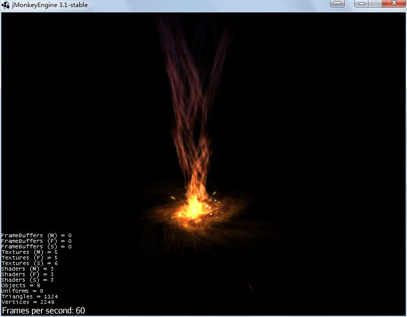
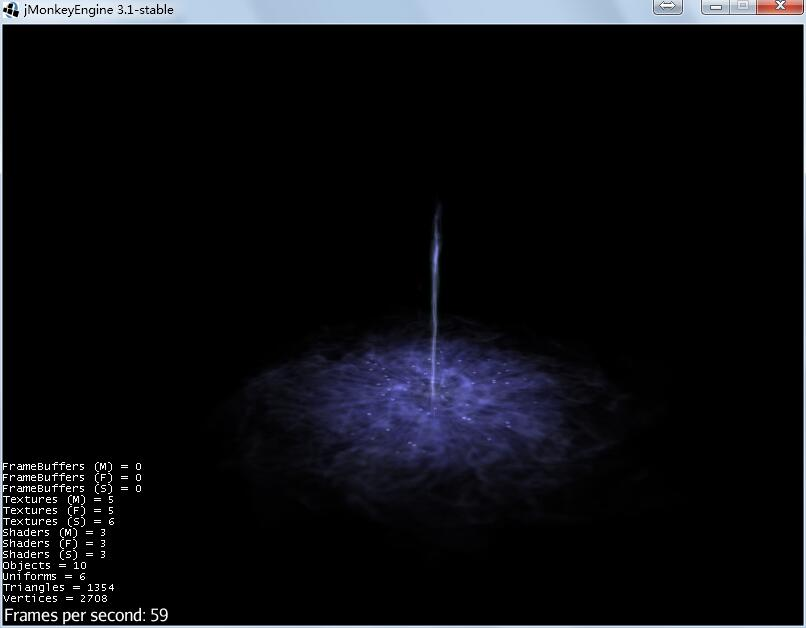
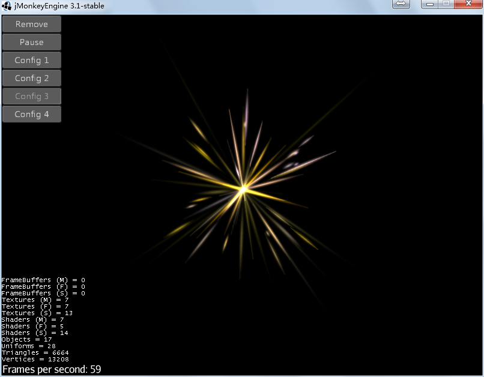
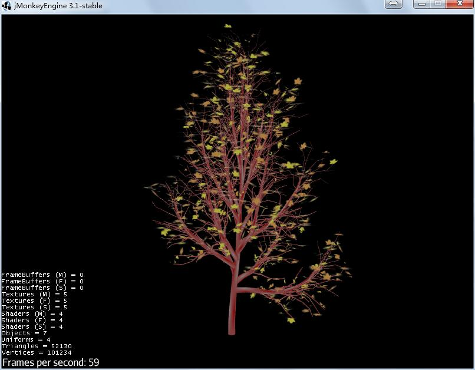

# tonegodemitter
Automatically exported from code.google.com/p/tonegodemitter

# Documentation

https://hub.jmonkeyengine.org/t/influencer-based-particleemitter-candidate-mesh-based-animated-particles/25831

https://hub.jmonkeyengine.org/t/particle-system-source-code-if-ya-want-it/28626

https://hub.jmonkeyengine.org/t/emitter-system-test-project/29728

http://jmonkeyengine.github.io/wiki/jme3/contributions/particles.html

http://jmonkeyengine.github.io/wiki/jme3/contributions/particles/reference.html

# Screenshots

# License

New BSD (3-clause) License. In other words, you do whatever makes you happy!
